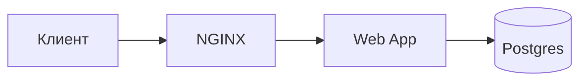
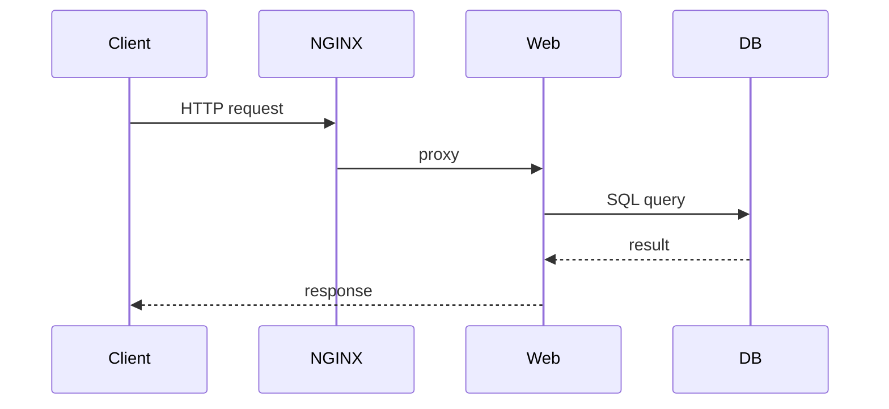

# Мои заметки

---

## Как я пользуюсь этим файлом

- Копирую команды в терминал и проверяю сразу.
- Храню примеры Dockerfile/Compose для быстрого старта.
- Сохраняю шаблоны диаграмм Mermaid, чтобы быстро визуализировать архитектуру.

---

## Bash — мои заметки и полезные команды

Я использую Bash для автоматизации задач: скрипты запуска, бэкапы БД, сборки локальной среды.

- Шебанг: ставлю `#!/usr/bin/env bash` в начале скриптов.
- Делаю скрипты безопасными:
  - `set -euo pipefail` — выход при ошибке/неопределённой переменной/ошибках в пайпах.
  - Проверяю входные параметры и права на файлы.
- Часто используемые команды:
  - `chmod +x script.sh` — сделать исполняемым
  - `./script.sh` или `bash script.sh` — запустить
  - `ssh user@host 'command'` — удалённый запуск
  - `tar -czvf backup.tgz /path/to/dir` — архивация
  - `pg_dump -U user -h host dbname > dump.sql` — бэкап Postgres

Простой шаблон скрипта, который я применяю:

```bash
#!/usr/bin/env bash
set -euo pipefail

readonly BACKUP_DIR="/backups"
mkdir -p "$BACKUP_DIR"

timestamp=$(date +%F_%T)
tar -czf "$BACKUP_DIR/site_$timestamp.tgz" /var/www/html
echo "Backup created: $BACKUP_DIR/site_$timestamp.tgz"
```

---

## Markdown — быстрые правила и лайфхаки

Использую Markdown для отчётов и README. Нравится, что файл читается без рендеринга.

- Заголовки: `#`, `##`, `###` — структурирую длинные заметки.
- Списки задач: `- [ ]` и `- [x]` — удобно для TODO.
- Кодовые блоки с подсветкой: ` ```bash
...``` `
- Таблицы — для кратких сводок (памятки по командами/портам).
- Полезные плагины для VS Code: "Markdown All in One", "Markdown Preview Enhanced".

Шпаргалка формата:

````markdown
# Заголовок

- Пункт списка
  `inline code`

```bash
echo hello
```
````

````

---

## Docker — практические заметки

Docker использую ежедневно: собираю образы, поднимаю стек через Compose, тестирую базы данных.

- Частые команды:
	- `docker build -t myapp:1.0 .`
	- `docker run -d --name myapp -p 8080:80 myapp:1.0`
	- `docker ps -a`, `docker images`
	- `docker rm -f <container>` / `docker rmi <image>`
	- `docker system prune -a` — осторожно, удаляет всё неиспользуемое

- Мой упрощённый `Dockerfile` для фронтенда (multi-stage):

```dockerfile
FROM node:18-alpine AS build
WORKDIR /app
COPY package*.json ./
RUN npm ci
COPY . .
RUN npm run build

FROM nginx:stable-alpine
COPY --from=build /app/build /usr/share/nginx/html
EXPOSE 80
CMD ["nginx", "-g", "daemon off;"]
````

- Минимальный `docker-compose.yml` для dev (веб + postgres):

```yaml
version: '3.8'
services:
	web:
		build: .
		ports: ['8080:80']
		volumes: ['./src:/app/src']
		environment:
			- DATABASE_URL=postgres://user:pass@db:5432/appdb
		depends_on: ['db']

	db:
		image: postgres:15-alpine
		environment:
			POSTGRES_USER: user
			POSTGRES_PASSWORD: pass
			POSTGRES_DB: appdb
		volumes: ['pgdata:/var/lib/postgresql/data']

volumes:
	pgdata:
```

Совет из практики: для CI собираю образ в отдельной job и не пушу `latest` — использую теги по sha.

---

## Mermaid — диаграммы и шаблоны, которые я использую

Mermaid удобно для визуализации архитектуры и последовательностей без внешних инструментов.

- Простейший граф (flowchart):



- Sequence диаграмма для запроса:



