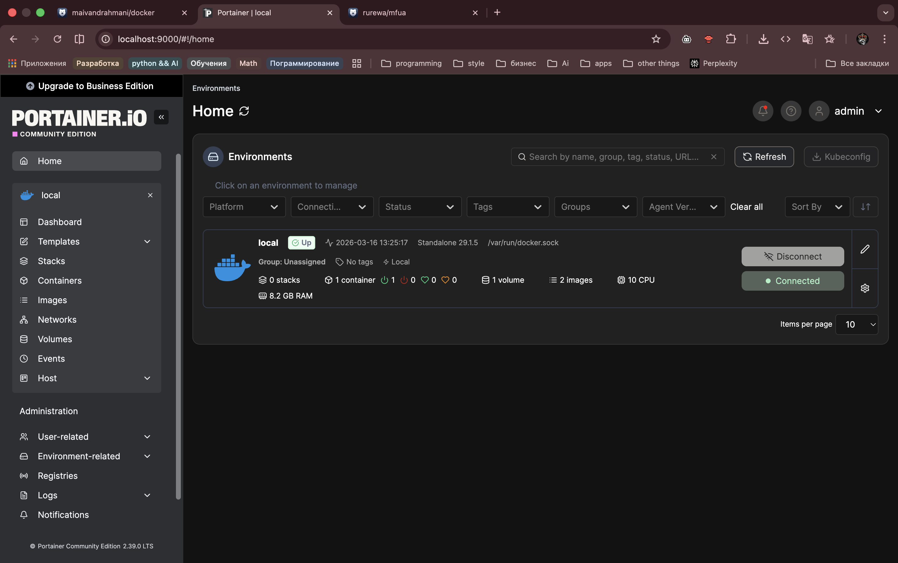
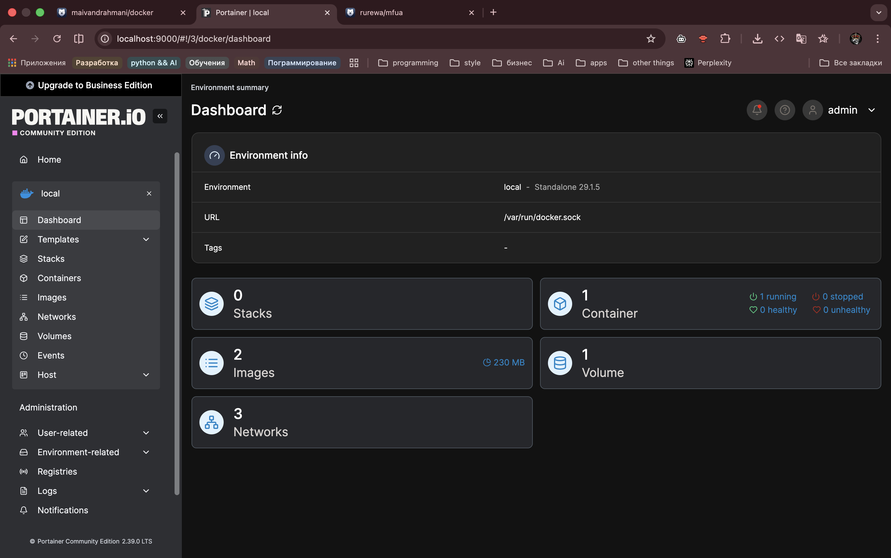
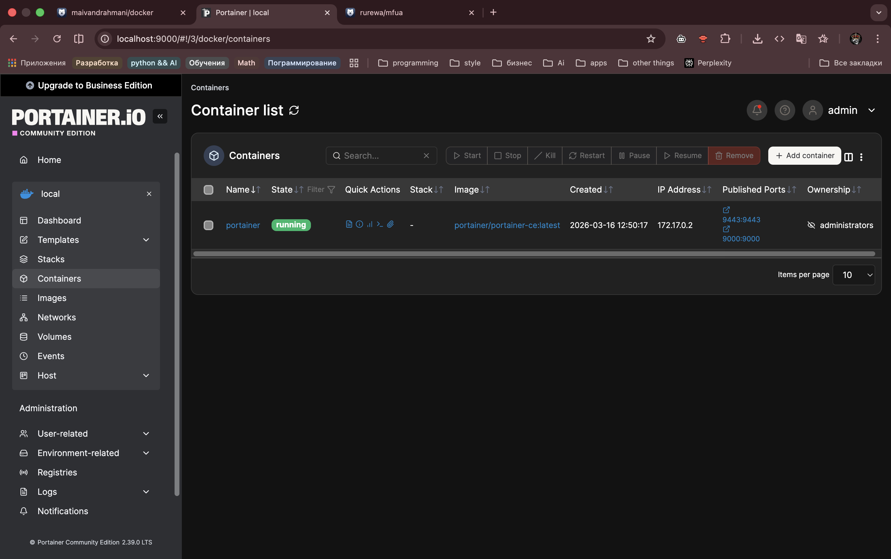
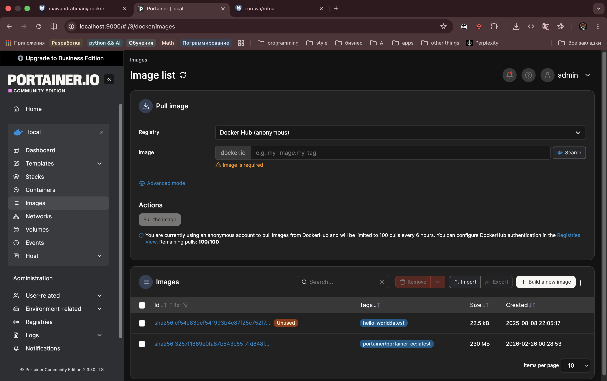

# Portainer для Partner: запуск и первый взгляд

Краткая инструкция, как запускал Portainer, и что видно сразу после старта.

## Команда запуска
```bash
docker run -d \
  --name portainer \
  -p 9000:9000 \
  -p 9443:9443 \
  -v /var/run/docker.sock:/var/run/docker.sock \
  -v portainer_data:/data \
  --restart unless-stopped \
  portainer/portainer-ce:latest
```

## Домашняя страница
На `home.png` видно общий статус Docker-демона, разноцветные карточки-статусы и быстрые кнопки перехода в нужные разделы.



## Дашборд
Дашборд (`dashboard.png`) показывает графики нагрузки, количество контейнеров и сетей, а также короткие ссылки для управления.



## Контейнеры
Секция `containers.png` позволяет быстро отметить работающие контейнеры, остановить/запустить их и посмотреть логи — все видно на одном экране.



## Образы
В `images_list.png` перечислены все локальные образы с тегами и размерами, оттуда легко чистить ненужные версии и запускать новые.




